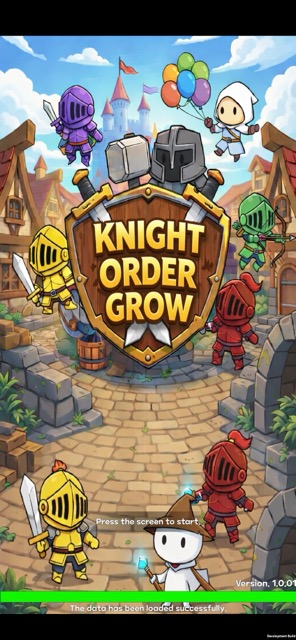
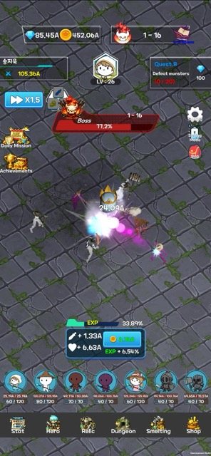

 

# Knight Order Grow
**Unity 기반 모바일 방치형 RPG | 1인 개발**

📹 [포트폴리오 영상 보기](https://youtu.be/gLDDEcBPnWE)

---

## 📖 프로젝트 소개

자동 전투, 강화, 던전, 가챠 등 방치형 장르의 핵심 콘텐츠를 구현한 모바일 RPG입니다.
Firebase 인증·클라우드 저장, Unity IAP, AdMob, 다국어 지원까지 실서비스 수준의 기능을 1인으로 개발했습니다.

| 항목 | 내용 |
|------|------|
| 개발 기간 | 2025.11 ~ 2026.03 |
| 플랫폼 | Android / iOS |
| 인원 | 1인 개발 |

---

## 🎮 주요 기능

- 🔐 **Google 로그인 / 게스트 계정** — Firebase Authentication 연동
- ⚔️ **자동 전투 / 스테이지** — 확률 기반 드랍, 패스트 모드
- 💤 **오프라인 보상** — 경과 시간 계산 + 리워드 광고 2배
- ⚡ **강화 시스템** — 캐릭터 레벨업, 유물 강화 및 장착
- 🏰 **던전** — 골드 던전 / 보물 던전 2종
- 💎 **가챠** — 영웅 / 유물 소환, 확률 테이블 기반 등급 결정
- 💳 **인앱 결제** — Unity IAP, Android 실기기 결제 테스트 완료
- 🌐 **다국어 지원** — 한국어 / 영어, 자체 로컬라이제이션 시스템

---

## 🔧 기술적 구현 포인트

### 1. Firebase 원자적 저장
> **문제** : 복수의 노드를 순차 저장하면 일부만 저장되는 데이터 불일치가 발생할 수 있음
> **해결** : 4개 노드(DATA / CHARACTER / ITEM / SMELT)를 단일 payload로 묶어 `SetRawJsonValueAsync()`로 원자적 저장.
> `CancellationToken`으로 중복 저장 방지, 네트워크 오류 대비 최대 3회 재시도 로직 적용

### 2. 커스텀 Update 루프 (ITickable)
> **문제** : 오브젝트마다 `Update()`를 사용하면 Unity의 개별 호출 오버헤드가 누적되어 성능 저하
> **해결** : `ITickable` / `IUnScaledTickable` 인터페이스와 `UpdateManager` 도입.
> `HashSet` 기반으로 중복 등록을 방지하고, scaled / unscaled 틱을 분리하여 중앙에서 일괄 관리

### 3. UI 자동 바인딩 (UI_Base)
> **문제** : Inspector 수동 연결 방식은 반복 작업과 휴먼 에러를 유발하고, 구조 변경 시 연결이 끊어짐
> **해결** : Enum으로 컴포넌트 이름을 정의하고 `Bind<T>()`가 `FindChild`로 자동 탐색하여 딕셔너리에 저장.
> `GetButton()`, `GetText()` 등으로 타입별 접근, `SerializeField` / `Find()` 남용 제거

### 4. Data-Driven 설계
> **문제** : 게임 수치를 코드에 직접 작성하면 밸런스 조정 시마다 코드 수정이 필요
> **해결** : 모든 게임 데이터를 JSON 직렬화 가능한 데이터 클래스로 분리.
> `ILoader<TKey, TValue>` 인터페이스 + `MakeDict()`로 런타임에 Dictionary 변환, 코드 수정 없이 데이터만 교체 가능

### 5. UniTask 기반 비동기 처리
> **문제** : `async void`는 예외 처리 불가, 코루틴은 반환값이 없어 복잡한 비동기 흐름 관리가 어려움
> **해결** : `async void` 전면 제거, `UniTask` / `UniTask<T>`로 대체.
> Firebase 로드, 씬 전환, 가챠 연출 등 모든 비동기 흐름을 통일하여 예외 처리와 흐름 제어를 명확하게 관리

### 6. 오브젝트 풀링
> **문제** : 매번 `Instantiate` / `Destroy`로 처리하면 GC 압력이 증가하고 런타임 성능 저하
> **해결** : Unity 내장 `ObjectPool<T>` 활용, 오브젝트를 재사용하여 메모리 할당/해제 오버헤드 최소화

---

## 🚀 실행 방법

1. Unity **2022.3** 이상으로 `IdleGame/` 폴더를 프로젝트로 열기
2. `Assets/2. Scnens/TitleScene` 실행
3. Firebase 연동 특성상 에디터 실행 시 일부 기능 제한될 수 있음
